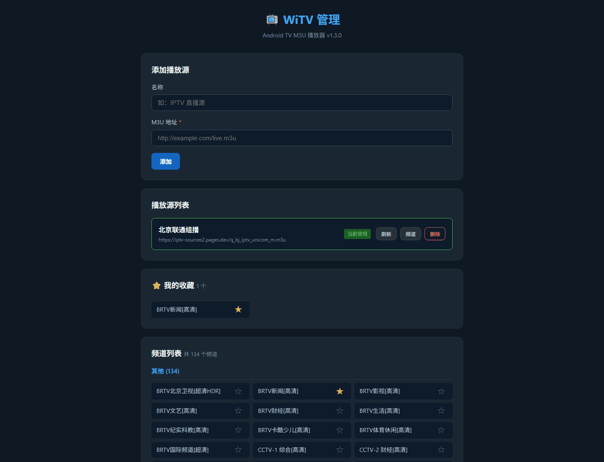
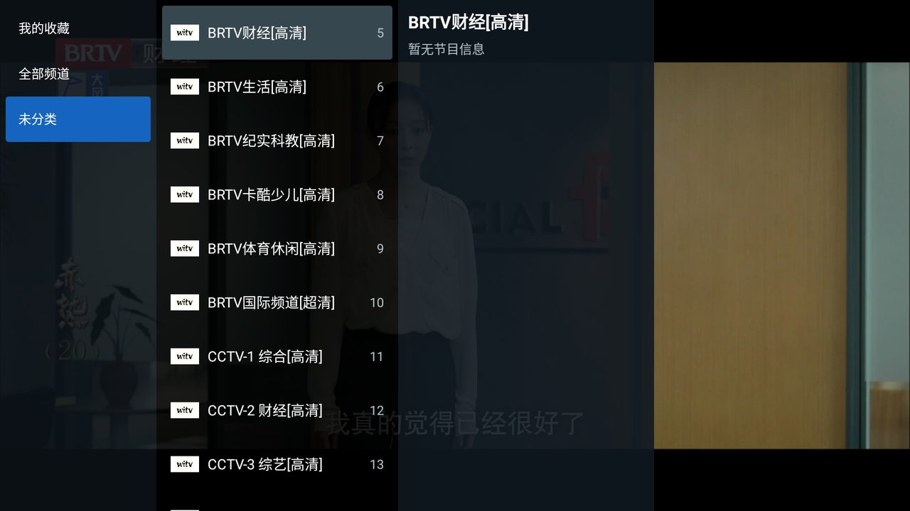
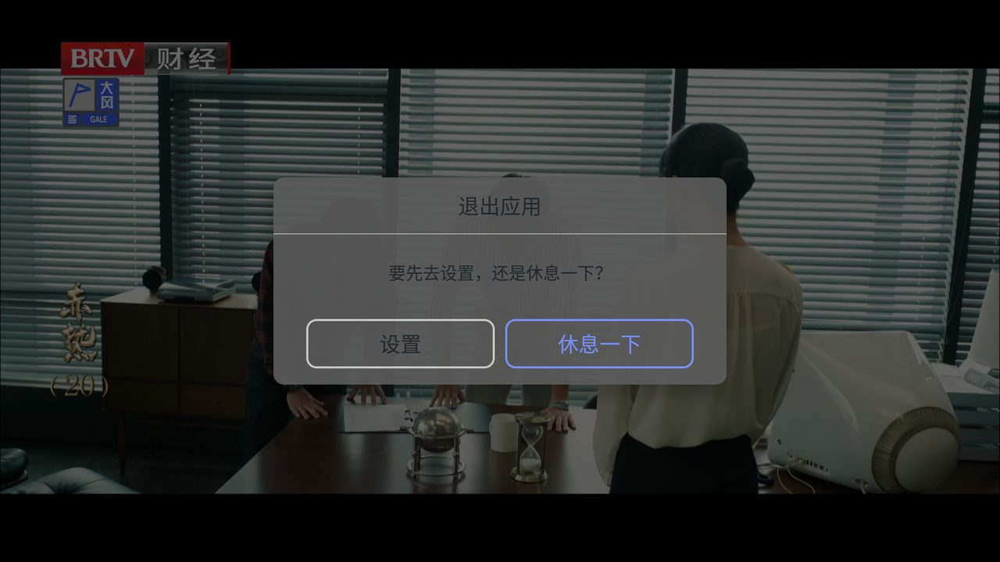
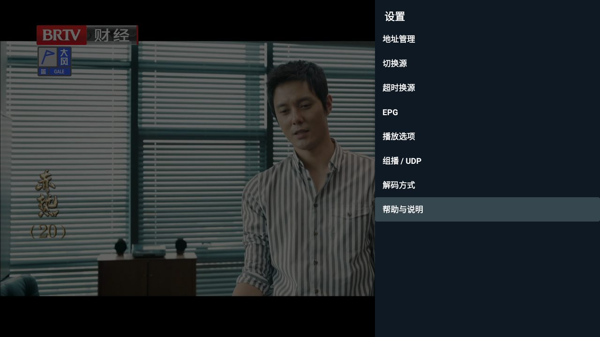
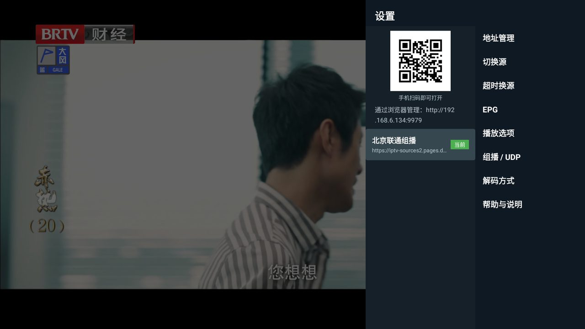
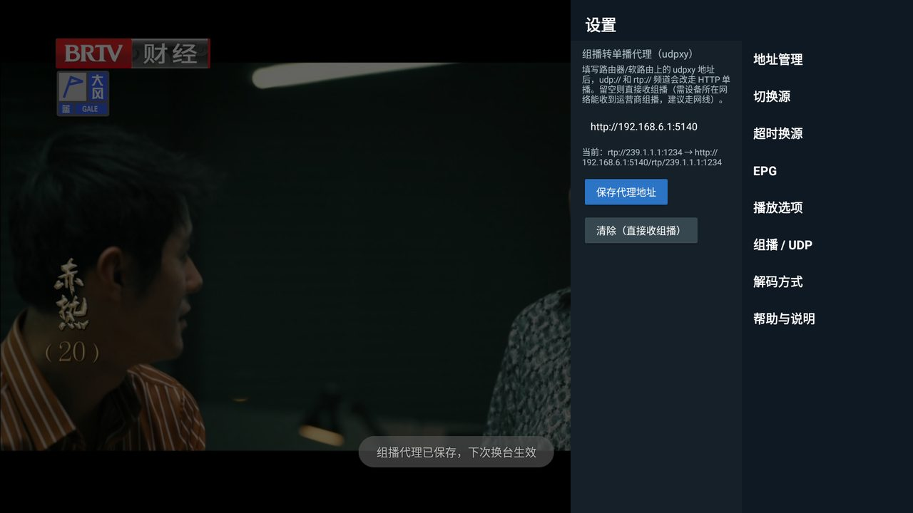
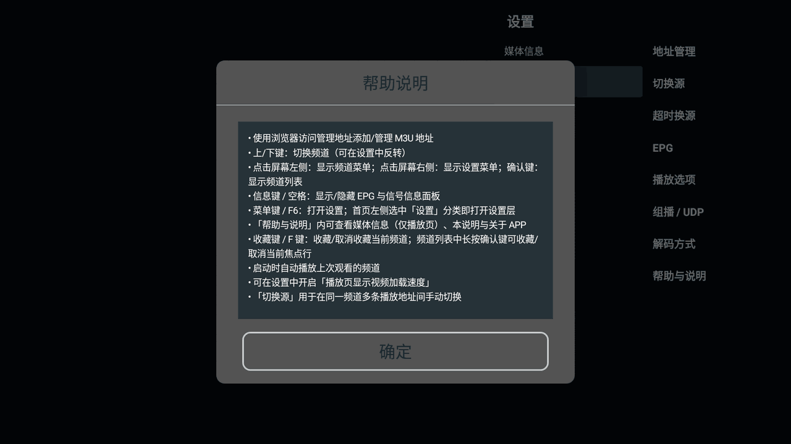
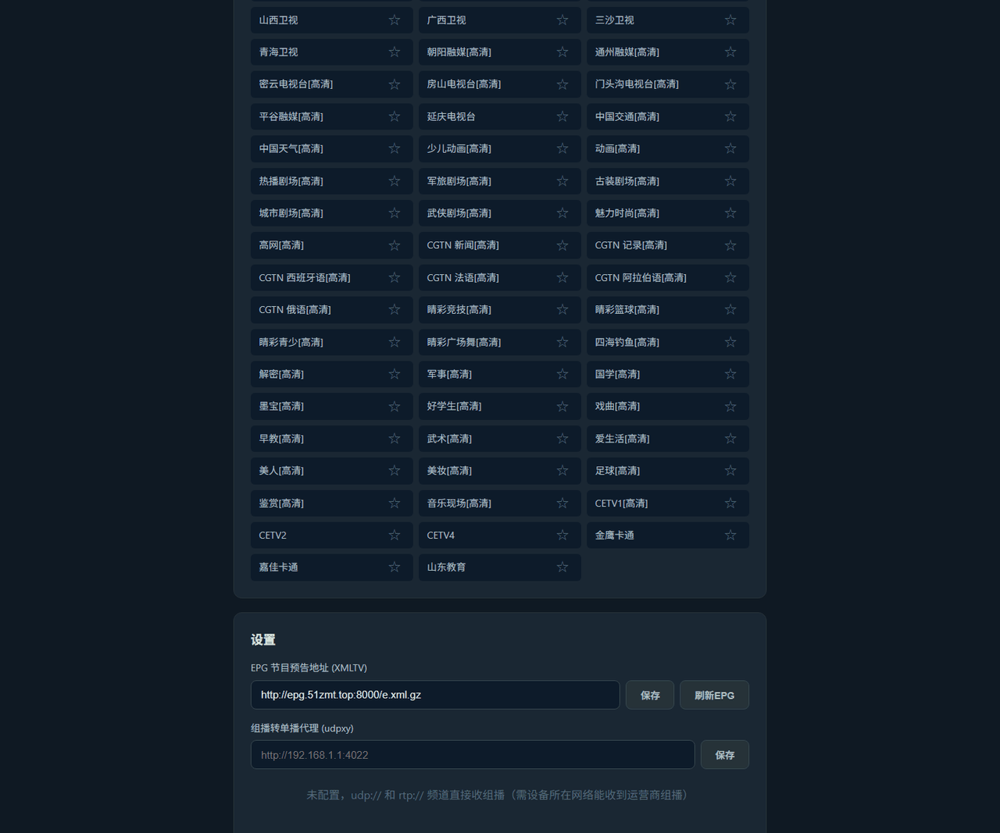

# WiTV 使用手册

WiTV 是一款运行在 Android TV / 电视盒子上的 IPTV 直播播放器。频道来自你自己提供的 M3U 地址，
节目单来自 XMLTV，支持运营商组播（`udp://` / `rtp://`）与普通 HTTP 直播流。

本手册中的截图取自真实设备（Amlogic 盒子，Android 7，有线连接）。

---

## 一、首次使用：添加播放源

首次启动时没有任何频道，播放页会显示一个二维码和局域网管理地址：


频道地址不在电视上输入——用遥控器敲 URL 太痛苦。做法是用**手机或电脑**打开那个地址：

- 手机：直接扫屏幕上的二维码；
- 电脑：在浏览器里输入下方的地址，例如 `http://192.168.6.134:9979`。

> 地址里的 IP 是盒子自己的局域网地址，接网线和连 Wi-Fi 都能正确识别。
> 如果显示的是 `0.0.0.0`，说明盒子还没拿到 IP，检查网线或 Wi-Fi 后点「刷新」。
> 手机/电脑必须和盒子在同一个局域网里。

打开后是 Web 管理页：



在「添加播放源」里填：

| 字段 | 说明 |
|------|------|
| 名称 | 随便起，用来区分多个订阅，例如「北京联通组播」。支持中文 |
| M3U 地址 | 直播源的 m3u / m3u8 地址，必填。也支持 `.m3u.gz` 压缩地址 |

点「添加」后会立即拉取并解析，解析完成就能在同一页看到频道列表与分组。

回到电视上点「刷新」，频道就加载进来了。

---

## 二、看电视

### 播放画面与信息

按**信息键**（或空格）显示/隐藏底部的节目与信号面板：


左下是当前频道、当前节目与下一档节目；右下是实际解出来的信号参数——分辨率、视频编码、
音频编码与声道数。排查「有画面没声音」「画面卡顿」时先看这里。

### 频道列表

按**确认键**打开频道列表：



- 左栏是分组（含「我的收藏」与「全部频道」），**左/右键**在分组栏和频道栏之间切换；
- 中间是频道，右侧是该频道当天的完整节目单；
- 在频道列表中**长按确认键**可以收藏/取消收藏当前这一行。

### 换台的几种方式

| 操作 | 效果 |
|------|------|
| 上 / 下键 | 切换上一个 / 下一个频道（方向可在设置里反转） |
| 数字键 | 直接输入频道号跳转，例如按 `1` `5` 跳到 15 号 |
| 确认键 | 打开频道列表挑选 |
| 收藏键 / `F` | 收藏或取消收藏当前频道 |

### 退出

在播放页按返回键会先确认一次，避免误触退出：



---

## 三、设置

按**菜单键**（或 `F6`）打开设置，左右两栏：右侧是分类，选中后左侧展开该分类的内容。
返回键先收起当前分类，再按一次才关闭设置。



### 地址管理



这里能看到管理地址的二维码、已添加的播放源和当前正在使用的那一个。增删改仍然在 Web 页面上做。

### EPG（节目单）


填 XMLTV 地址即可，**支持 `.xml.gz` 压缩地址**（公开 EPG 源基本都是 gz，几十 MB 的节目单压缩后只有几 MB）。
如果 M3U 里带了 `x-tvg-url`，这一栏会自动填好，一般不用手动改。

改完按「保存 EPG 设置」，再按「刷新 EPG 数据」立即拉取。

### 组播 / UDP


频道地址是 `udp://` 或 `rtp://` 时才用得上：

- **留空**：直接收组播。要求盒子所在的网络能收到运营商组播，**强烈建议走网线**——
  2.4G Wi-Fi 常常丢大包，表现为花屏和不断缓冲；
- **填 udpxy 地址**（如 `http://192.168.1.1:4022`）：组播改走 HTTP 单播，由路由器/软路由代理。
  适合盒子收不到组播、或只能用 Wi-Fi 的场景。

填好按「保存代理地址」。输入框下方会实时显示改写后的结果，确认无误再保存：



改写规则是把 `scheme://组播组:端口` 拼成 `代理前缀/scheme/组播组:端口`，例如

```
rtp://239.3.1.118:8001  →  http://192.168.6.1:5140/rtp/239.3.1.118:8001
```

地址前缀不用写 `/udp` 或 `/rtp`，也不用在意结尾的 `/`，保存时会统一规范化；
`http://` 省略也能识别。

> **保存后不会立刻切换**，提示是「下次换台生效」——当前这一路组播不中断，换台时才走新配置。

**不是只有 udpxy 能用。** 任何提供 udpxy 兼容路径的软件都行，例如 OpenWrt 上常见的
[rtp2httpd](https://github.com/stackia/rtp2httpd)，它同样接受 `/rtp/组:端口` 和 `/udp/组:端口`。

#### 代理和直收，选哪个

在 Amlogic 盒子（有线千兆）上实测同一路北京联通组播，两种方式各跑 60 秒：

| | 起播耗时 | 重缓冲 | 硬解器 `error_recovery` |
|---|---|---|---|
| 直收组播 | 2.1 s | 0 | 6 次 |
| 经 rtp2httpd 代理 | 2.3 s | 0 | 9 ~ 12 次 |

测试频道是 3840×2160 HDR / H.265 / 杜比数字 6 声道，实测码率约 40 Mbps；
1080p H.264 频道两种方式都是秒开。

结论是**有线环境下两者都够用**，代理那点差异在一分钟的样本里还算不上信号。
真正该用代理的是这两种情况：盒子所在网段收不到运营商组播，或者只能走 Wi-Fi。

### 解码方式


| 选项 | 什么时候用 |
|------|-----------|
| 硬解优先（推荐） | 默认。优先用盒子的硬件解码器 |
| 音频软解 + 视频硬解 | **杜比声道没声音时选这个**。音频交给 FFmpeg，绕开杜比直通；视频仍走硬解，不增加 CPU 负担 |
| 全部软解优先 | 音视频都用 FFmpeg。CPU 占用高，低端盒子上 1080p 以上会卡 |
| 仅硬解 | 完全不加载软解，用于排查软解自身引入的问题 |

切换后播放器会重建，画面会黑一下再恢复，属于正常现象。

### 播放选项


- **启动播放上次频道**：开机直接进上次看的台；
- **启动时刷新 M3U 直播源**：每次进播放页先刷新订阅再起播，刷新失败仍回退到本地缓存；
- **使用硬盘缓存预取直播分片**：为 HLS 的 ts 分片启用磁盘预取与缓存命中；
- **播放页显示视频加载速度**：右上角实时显示估算速度，排查网络时有用；
- **反转换台键**：上/下键的换台方向与默认相反。

### 切换源 / 超时换源

同一个频道在 M3U 里可能有多条播放地址。「切换源」用于手动在这几条之间切换；
「超时换源」则是卡住多久之后自动换下一条。

### 帮助与说明



「媒体信息」显示当前播放的详细参数，「帮助说明」就是上图这份按键速查表，「关于 APP」显示版本号。

---

## 四、Web 管理页



除了增删播放源，Web 页面还能：

- **刷新**单个订阅、查看它解析出的**频道**列表；
- 点频道旁边的星标**收藏**，收藏结果会同步到电视上的「我的收藏」分组；
- 在页面底部配置 **EPG 地址**与**组播转单播代理**，和电视上的设置是同一份数据。

---

## 五、常见问题

**管理地址显示 `0.0.0.0`**
盒子还没拿到局域网 IP。检查网线/Wi-Fi，确认路由器已分配地址，然后点「刷新」。

**手机打不开管理地址**
手机和盒子要在同一个局域网（同一个路由器，且没开 AP 隔离）。
端口是 `9979`，注意不要漏掉。

**杜比频道有画面没声音**
设置 →「解码方式」→ 选「音频软解 + 视频硬解」。

**组播频道花屏、一直缓冲**
优先改用网线。只能用 Wi-Fi 时，在路由器/软路由上装 udpxy 或 rtp2httpd，然后在「组播 / UDP」里填它的地址。

**节目单是空的**
确认「EPG」里的地址可访问；地址可以是 `.xml` 也可以是 `.xml.gz`。
另外 M3U 里频道的 `tvg-name` / `tvg-id` 要和 EPG 里的频道名对得上，对不上就会显示「暂无节目信息」。

**列表名或频道名显示成乱码**
升级到 v1.3.0 及以上版本。
