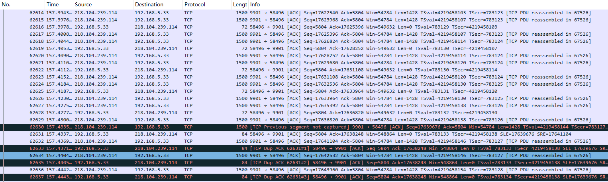
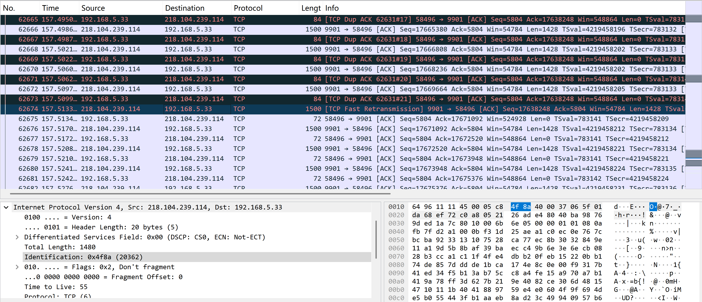
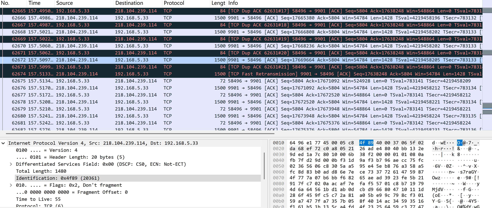
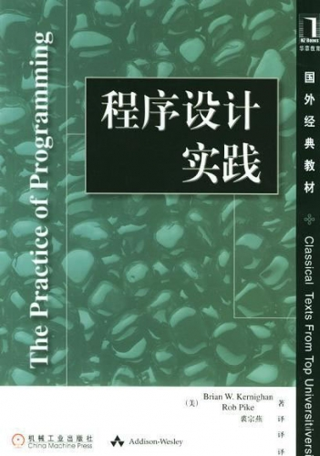

# AI 让我重拾安卓开发梦，结果被 TCP 丢包教育了
最近国内对于版权管控越来越强烈了，之前的电视家等应用纷纷关闭，所以我就想自己搜集网上的一些直播源来自建一个直播系统。
经过了一番筛选之后，我还真找到了一个能播的源，是国内酒店系统的iptv源，但是这个源有一个问题，播十几秒后，就会卡一几秒，然后才能续播。我心想是不是做播放的播放器优化的不够好，因为我拿程序测试其ts地址，下载速度挺快的。所以我决定自己做一款播放器，说不上上述问题就迎刃而解了。  
但是自己对于安卓开发就是个半吊子水平，完全无法胜任这种规模开发，幸好现在是 ai 时代，氛围编程可以帮大忙。说来也是可笑，想当年安卓手机刚面世时，一部分同事还在评论安卓在苹果面前就是个弟弟，很多应用都不完善。我当初还不以为意对大家说，有啥需要的应用，不能自己开发吗？想想当初确实是年轻气盛了，这么多年，自己基本没有开发啥像样的安卓程序，后来自己绝大部分都是做后端开发，开发安卓应用的事情早就抛到九霄云后去了。不过，现在时代不同了，我想当年吹过的牛皮，也许就能实现了。
说干就干，我拿出cursor，新建了个目录，给它一段todo.md来描述需求，然后它就哐哐哐的开始干活了。不一会儿的功夫，它就完成了一个初始化好的项目。但是想编译成apk的时候却遇到了点小问题，我的安卓 sdk没有配置在环境变量中，不过ai通过查找电脑常用路径，很快就找到了，最终成功编译成功。  
接下来就是对其测试了，不测不要紧，一测就大跌眼镜，明明通过程序测试着下载速度杠杠的，咋放到播放器里还是间歇性卡顿呢？让ai帮忙分析下原因吧。它跟我说可以把当前播放器缓冲的时间调大些，这样对于偶现的卡顿就能cover住了。我接受了它的建议，卡顿的频率看上去是降低了，但是没有根治。随后我又让其把项目中的性能问题统一优化一下，但是收效甚微，事情到这一步就有点黔驴技穷了。不过我转念一想，是不是由于我这用的是PC端模拟器导致的啊，要不我换真实硬件试试？  
N年前，我在某多多买过一个n1盒子，这么多年了一直在服役（虽然在某个夏天的下午它的USB口的供电电路烧坏了，但是不影响使用）。不得不夸一下，这个n1就是调试神器啊，可以使用 adb 远程连接，可以使用ssh远程登陆安装arm原生程序。不出意外，播放器在n1上依然是卡顿的。事情进行到这一步，我决定使出洪荒之力了，抓包来看一下这个卡顿的原因。  
对于 N1 这种 arm64 架构的硬件来说，可以从下载 [安卓专用tcpdump](https://www.androidtcpdump.com/android-tcpdump/downloads64bit)。下载完成后，拷贝到环境变量 PATH 中指向的其中一个路径即可使用。然后运行命令 `tcpdump -i any port hls地址的端口 -w /tmp/hls.cap &` ,然后打开播放器播放开始播放。播放地址可以提前播一遍，通过播放器 UI 查看并记录下来，退出后重新打开，在打开之前提前运行 tcpdump 命令，这样可以保证抓取到所有的包。  
播放一会儿，出现几个卡顿后，将抓包生成的 hls.cap 导出来，用 wireshark 打开来看一下，发现了一系列的丢包的情况：

前一个包（No. 62629）的 Seq 是 17636820，长度 1428，所以下一个包应该是 17638248。但 No. 62630 的 Seq 却是 17639676，中间正好缺了一个 1428 字节的段。

接收端立刻回了一个 ACK(No. 62631)，并在 Info 中包含了 SLE=17639676 SRE=17641104，接收端在告诉发送端：“我还没收到 17638248 开始的那段数据（所以 Ack 还是停留在 17638248），但我已经收到了后面 17639676 到 17641104 的数据了，你别重传这一段。” 62631 包发完后，发送端没有理会，依然发送视频流数据，接收端不甘心又通过 No. 62633 - 62637 三个包连续告知发送端赶紧重传17639676 到 17641104之间的数据。

在经过接收端 21 次提醒后，发送端终于在包 62674 中选择了重传丢失的数据包。

不过我们查看一下 62674 包中 IP 层的 Id 值为 20362，但是发送端上一个包 62672 中 IP 层的 Id 值为 20361，说明当时操作系统直接把17639676 到 17641104之间的 TCP 段从发送队列中移除了，没有将其包装成网络数据包发送出去，也就是说很有可能发送端配置了 QOS 机制，定期来丢弃数据包。

分析了一下抓包中的更多数据，发现这种丢包的情况还比较频繁，这样就导致视频长度本来是 X 秒，但是由于丢包导致下载的时间就得 X+Y 秒，不卡才怪。

## 改进
看到上面的结果，我并没有甘心，m3u8 文件是一个列表文件，其中包含若干个 ts 分片的链接，这些链接的顺序是按照时间顺序排列的。虽然从抓包看一个若干段分片加载的时间比较长，但是如果我提前做加载呢？也就是说在播放器播放当前分片的时候，提前加载后面几个分片，这样即使当前分片出现丢包导致加载时间变长了，也不会影响到后续分片的加载，从而避免卡顿的情况。

我依稀记得上学的时候，我的老师在上《程序设计实践》时给我们讲过一个法则，就叫做拿空间换时间。也许这次就能用上了。

于是我告诉 AI 让其做一个线程池，固定消费当前播放分片后面的三片，将下载的数据缓存到硬盘，等播放器播放下一个分片的时候，说不上就可以用上缓存的数据了。可以等 AI 将上述思路实现后，我发现缓存的利用率总是不理想，我又自己尝试优化了缓存的细节，每次想着一定能成功，却每次都败下阵来。

后来通过补充日志发现，播放器根本不是堵塞式加载 ts 分片的，它不会老老实实的播放完当前分片后，再尝试下载下一个分片。也就是说播放器自己也维护了一层缓存，而这次缓存也经常和我硬盘中的缓存撞车。为了防止播放时堵塞，播放器在取某个固定分片时，如果没有下载完，就直接从网络下载，而不是等我硬盘中的缓存下载完了再去拿，这样就导致了我的预取模型失效了。

看来这个拿空间换时间的路数，人家谷歌团队早就想到了，目前这个播放卡顿的情况，只能从视频源本身着手解决了，也许换一个更优的视频源，才是正道。
## 思考

AI 确实很智能，每次和它沟通，我都很愉快，它也教会了我很多知识。如果将一个技术人员比作八爪鱼，借助于 AI，现在这条八爪鱼的触角就变得越长了。但是针对固定的项目来说，八爪鱼的触角并不能将项目中的一亩三分地完全覆盖到。技术开发中还是得有相关经验做支撑，否则就会遇到上面我遇到的问题，虽然理论是完全正确的，但是做的却是无用功。